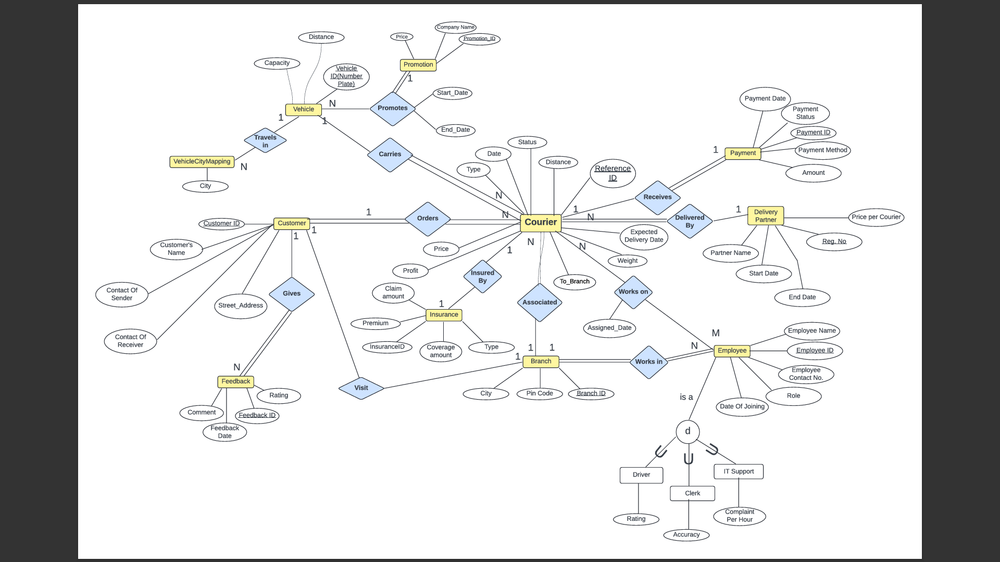
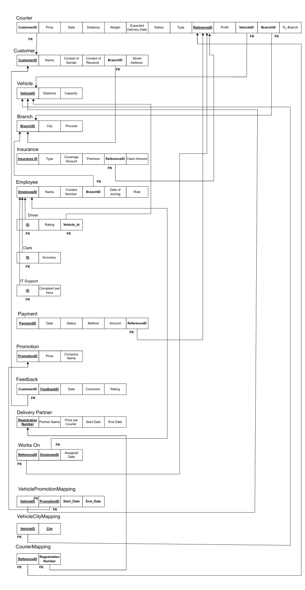
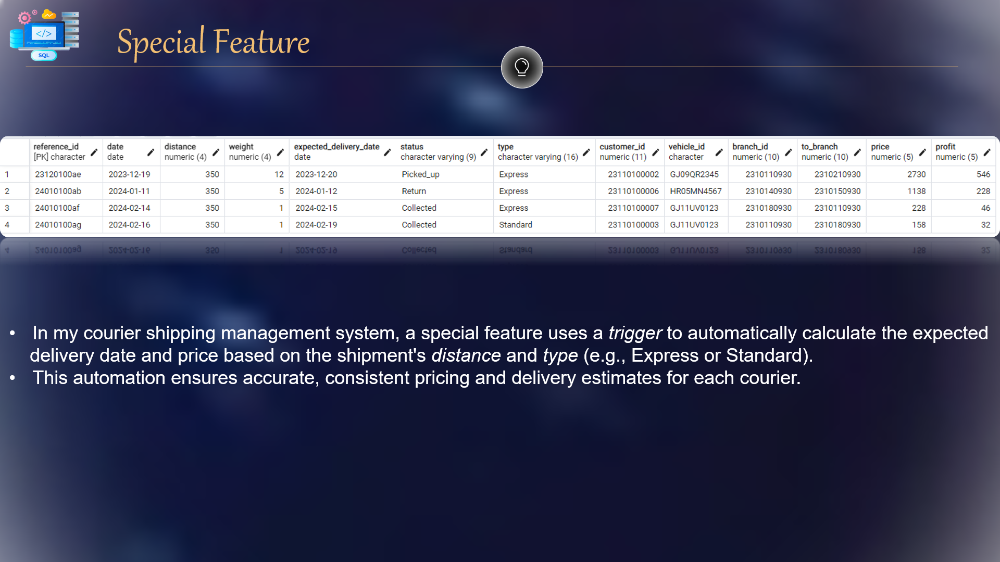
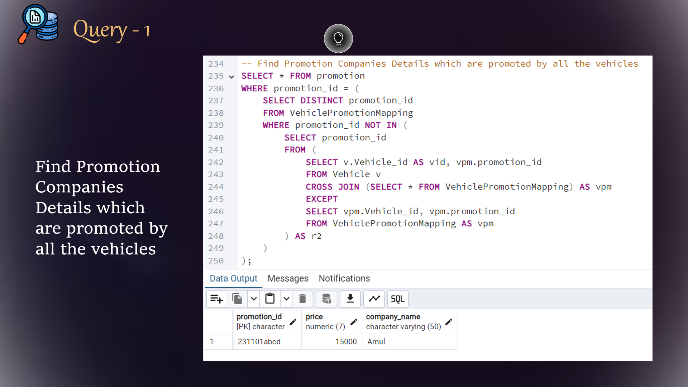
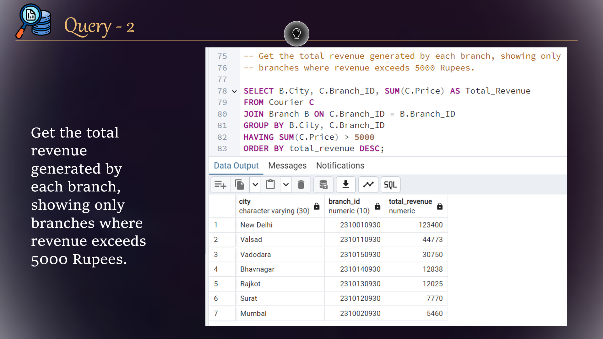
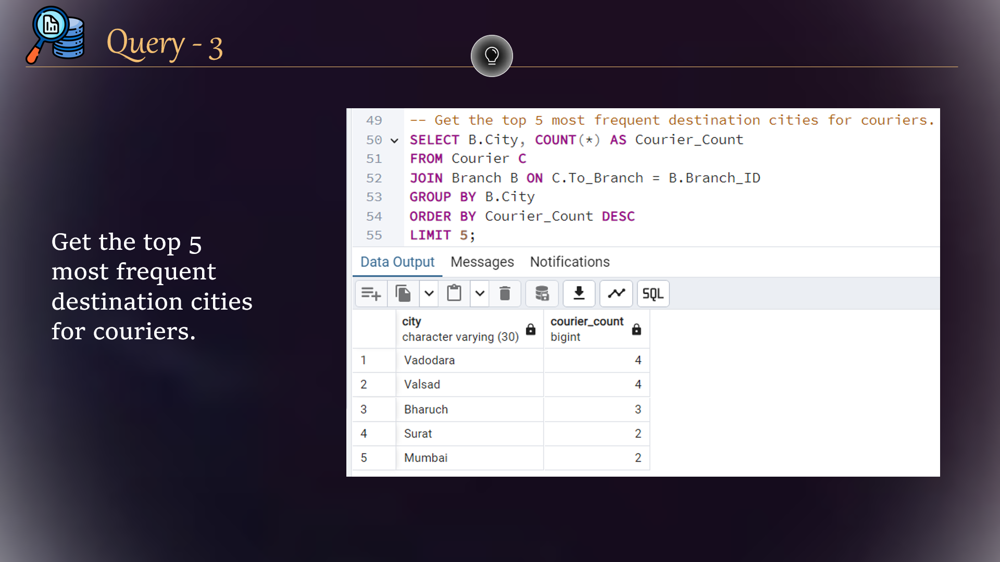
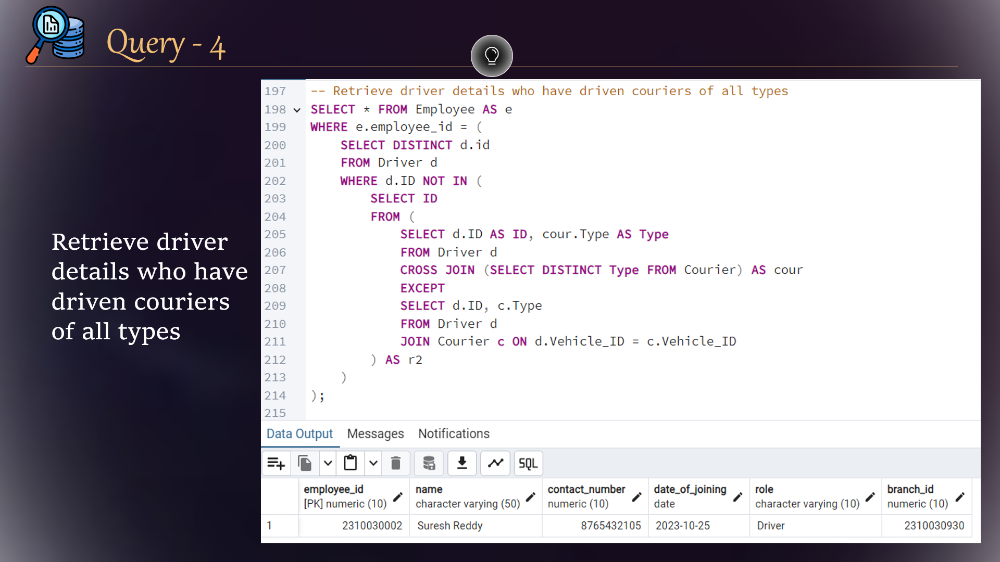
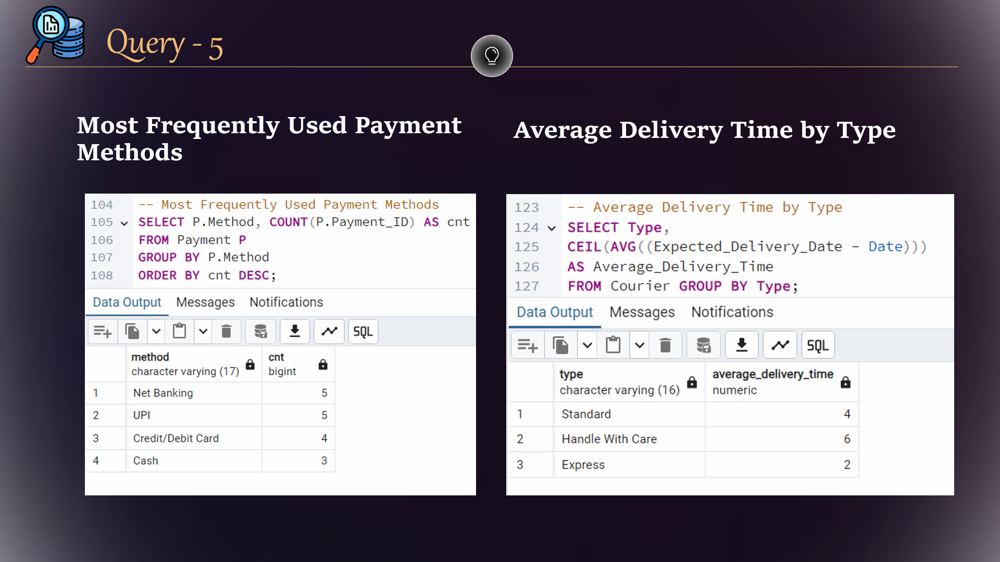

# Courier Shipping Management System
The  goal  of  this  project  is  to  design  and  implement  a  database  management  system  for 
a  Courier  Shipping  Management  System  .  This  system  will  manage  all  aspects  of  the 
courier  shipping  process,  including  customer  information,  courier  details,  vehicle 
management,  employee  details,  and  customer  feedback.  The  database is designed 
using PostgreSQL and will support efficient information storage and retrieval.

## 🚀 Project Live Link
<h3> Check out website Live Link </h3>

<h3><a href="https://courier-shipping-management-system.streamlit.app/" target="_blank" style="font-size: 24px;">Click Here</a></h3>

<h3> Or </h3>

`https://courier-shipping-management-system.streamlit.app/`

## Project Details

## ER Diagram

## Relational Diagram

## Key Feature

## Important Queries

## 📢 View the Presentation  

Click the link below to view the PowerPoint presentation:  

[📑 Open Presentation](Presentation.pptx)
